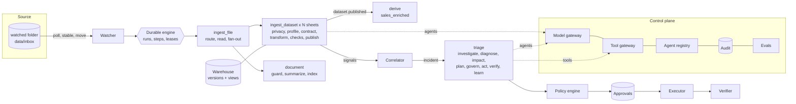

# SwarmPipe - a hands-on, production-grade multi-agent data pipeline

SwarmPipe is a standalone application you can run on your laptop to learn - **practically** - how an entire
agentic system works end to end: a watched folder is the data source, every file becomes a durable
workflow, a swarm of 27 agents ingests, validates, publishes, and - when something breaks - investigates,
diagnoses, plans and (under policy) remediates, while everything is traced, metered, audited and evaluated.

It turns the core concepts of production agentic systems (agent loops, multi-agent patterns, MCP/A2A, context
engineering, durable execution, evaluation, security, identity, cost, model strategy, observability vs audit,
data observability, lineage, trusted context, governance, autonomy ladder, evidence packs, PRDs with eval
specs...) into code you can run, break and fix.

> **Offline by default.** The default LLM profile uses two *simulated* models (`sim-small`, `sim-large`) that run
> in-process, deterministically and for free, so nothing leaves your machine. Switch to a real local model
> (e.g. Ollama `llama3.2`) or Azure OpenAI/OpenAI with one command. Prices shown for the
> simulated models are illustrative.

---

## Quick start (5 minutes)

```powershell
git clone https://github.com/sumanthewhiz/SwarmPipe.git
cd SwarmPipe
python -m venv .venv                  # Python 3.11+
.\.venv\Scripts\Activate.ps1          # macOS/Linux: source .venv/bin/activate
pip install -r requirements.txt
python -m swarmpipe init              # state DB, contracts, runbooks, agent registry, prompt lock
python -m swarmpipe run               # watcher + 4 workers + event bus + monitors + dashboard
```

Open **http://127.0.0.1:8765** and go to **Scenarios & Chaos**:

1. Drop **baseline** (customer master .xlsx with 2 sheets, a legacy inventory .xls, 4 days of sales .csv).
2. Drop **volume_drop** -> watch **Runs** (the circuit breaker quarantines the batch) and **Incidents** (the swarm
   investigates, diagnoses *truncated extract*, auto-executes low-risk containment, verifies it).
3. Drop **schema_drift** -> an approval appears in **Approvals**; approve it -> the batch is reprocessed with a
   column mapping the agents inferred from value patterns -> incident *resolved*.
4. Drop **injection**; then start a fresh workspace (stop the server, `python -m swarmpipe reset --yes`,
   `python -m swarmpipe init`, start it again, drop **baseline**), set *Spotlighting OFF* + *Critic OFF* and drop
   **injection** again -> watch the model get fooled and the architecture still contain it (Lab 4).

Or copy your own `.csv / .tsv / .txt / .xlsx / .xls` files into `data\inbox\` (sub-folder = tenant, e.g.
`data\inbox\acme\`). Point the watched folder anywhere: `SWARMPIPE__PATHS__INBOX=D:/DropZone`.

No server? Everything also works synchronously: `python -m swarmpipe scenarios drop baseline --process`.

## What you get

| Area | What is implemented (and where to read it) |
|---|---|
| Durable orchestration | SQLite-backed workflow engine: checkpoints, leases + heartbeats + fencing, retries with jittered backoff, deferral, timeouts, saga compensation, human/child interrupts, DLQ - `swarmpipe/runtime/engine.py` |
| Data pipeline | polling watcher with stability detection and backpressure; readers for csv/tsv/pipe-txt/xlsx/xls with encoding + delimiter sniffing; contracts-as-code; typed transforms with row-level rejects; data-assurance checks + circuit breaker; immutable versions with blue/green publish, snapshots and rollback; OpenLineage events - `swarmpipe/data/`, `swarmpipe/runtime/workflows.py` |
| Agent swarm | Router, Privacy Guard, Profiler, Contract Steward + Critic, Transformer, Data Assurance, Publisher, Correlator, Triage Supervisor + 9 specialist Investigators, Impact Analyzer, Planner, Executor, Verifier, Learner, Analyst, Librarian, Judge - `swarmpipe/agents/` |
| Multi-agent patterns | router, sequential handoff, parallel fan-out/fan-in, orchestrator-workers, hierarchical, evaluator-optimizer, blackboard - see `docs/LEARNING_GUIDE.md` |
| Model gateway | routing by role with fallback chains, circuit breakers, bulkhead, retries, JSON extraction + schema validation + repair loop, cache, token/cost metering, per-run budgets, per-tenant quotas, PII redaction, secret-leak blocking, context compaction - `swarmpipe/llm/gateway.py` |
| Tools / MCP / A2A | MCP-style tool gateway (schemas, annotations, allowlists, scopes, rate limits, evidence ids, supply-chain fingerprints, rogue-agent auto-suspend); stdio **MCP server** for Copilot CLI; A2A agent cards + task endpoint - `swarmpipe/tools/`, `swarmpipe/mcp_server.py`, `swarmpipe/web/api.py` |
| Governance | policy-as-code engine, autonomy ladder L0-L4 with evidence-based promotion and automatic demotion, server-side approvals with typed confirmation, kill switches, hash-chained audit log, evidence packs, identity with delegation (intersection), short-lived tokens, secrets broker, signed inter-agent messages - `swarmpipe/governance/` |
| Observability | traces with OpenTelemetry GenAI attribute names (one trace across every agent), head + tail sampling, metrics, Prometheus exposition, SLOs with error budgets, structured JSON logs with correlation ids - `swarmpipe/observability/` |
| Evaluation | scenario-based offline evals (component, trajectory, outcome, safety, efficiency), pass@k vs pass^k, red-team suite with defense ablations, calibrated LLM-as-judge (kappa, position and verbosity bias), CI gate + prompt lock, per-role model certification, harvest of production incidents into regression cases - `swarmpipe/evals/`, `evals/` |
| Operator surfaces | dashboard (12 tabs), REST API (`/docs`), CLI (`swarmpipe --help`), MCP server |

## Architecture at a glance



Full diagrams, trust boundaries and design decisions: [`docs/ARCHITECTURE.md`](docs/ARCHITECTURE.md).

## Documentation

| Document | Read it for |
|---|---|
| [`docs/LEARNING_GUIDE.md`](docs/LEARNING_GUIDE.md) | **Start here.** Every core concept (plus production details that are easy to miss) -> the exact code -> how to see it -> how to break it |
| [`docs/LABS.md`](docs/LABS.md) | 18 guided hands-on labs with commands, expected observations and reflection questions |
| [`docs/ARCHITECTURE.md`](docs/ARCHITECTURE.md) | control/data plane, sequence diagrams, trust boundaries, data model, trade-offs, what changes at real scale |
| [`docs/SECURITY_OWASP_MAPPING.md`](docs/SECURITY_OWASP_MAPPING.md) | OWASP Agentic Top 10 (ASI01-ASI10) and LLM Top 10 -> controls -> code -> tests |
| [`docs/PRD_AND_EVAL_SPEC.md`](docs/PRD_AND_EVAL_SPEC.md) | a PRD + evaluation spec for the triage feature: problem, autonomy per action, grounding, evals, SLOs, rollout gates |
| [`docs/OPERATIONS_RUNBOOK.md`](docs/OPERATIONS_RUNBOOK.md) | operating the agent system itself: SLOs, kill switch, DLQ, model/prompt upgrades, AI-caused incidents |

## LLM profiles

| Profile | Models | Notes |
|---|---|---|
| `offline` (default) | `sim-small`, `sim-large` (simulated) | deterministic, instant, free; every failure mode is a chaos knob |
| `ollama` | `llama3.2:latest` with simulated fallback | real local model (~20-30 s per call on this CPU); watch real JSON failures, repairs and fallbacks |
| `azure` / `openai` | `gpt-4o-mini` with simulated fallback | set `AZURE_OPENAI_ENDPOINT` / `AZURE_OPENAI_API_KEY` (or `OPENAI_API_KEY`) as env vars or in `.secrets.json`; **data leaves your machine** |

Switch at runtime (affects a running server): `python -m swarmpipe llm use ollama` or the LLM selector in the
dashboard header. Certify a model per role before trusting it: `python -m swarmpipe evals certify --model llama3.2 --roles router`.

## CLI cheat sheet

```powershell
swarmpipe status | tick | runs list | runs show <run_id> | trace <run_id|inc_id>
swarmpipe scenarios list | scenarios drop <name> [--tenant acme] [--process]
swarmpipe incidents list | incidents show <inc_id> | evidence <inc_id>
swarmpipe approvals list | approvals approve <apr_id> [--as oncall] [--confirm sales_daily] [--comment "..."]
swarmpipe actions execute <proposal_id> | actions rollback <proposal_id>
swarmpipe ask "total revenue by region" --as analyst     (try --as admin to see PII detokenized)
swarmpipe killswitch on|off [--scope global|agent:<id>|tenant:<t>|action:<class>|llm]
swarmpipe autonomy list | autonomy set <action> <L0-L4> | policy <action> --injection
swarmpipe chaos show | chaos set llm_timeout_rate 0.3 | chaos crash-after transform | chaos clear
swarmpipe audit verify | audit tamper --seq 3 | audit tail
swarmpipe evals run --suite triage --k 3 --noise 0.2 | evals gate --update-lock | evals calibrate-judge --version v1
swarmpipe metrics [--prom] | slo | llm status | llm use ollama | mcp
```

(`swarmpipe` is available after `pip install -e .`; otherwise use `python -m swarmpipe`.)

## Use it from GitHub Copilot CLI (MCP)

Add this server to `~/.copilot/mcp-config.json` (not done automatically), replacing `<repo>` with the absolute
path of your clone (on macOS/Linux the interpreter is `<repo>/.venv/bin/python`):

```json
{ "mcpServers": { "swarmpipe": { "type": "local",
    "command": "<repo>\\.venv\\Scripts\\python.exe",
    "args": ["-m", "swarmpipe", "mcp"], "cwd": "<repo>",
    "tools": ["*"] } } }
```

Then ask Copilot things like "what incidents are open in swarmpipe and why?" or "approve the pending
reprocess_with_mapping approval".

## Tests and CI gate

```powershell
python -m pytest                      # 54 tests, ~45 s, isolated temp workspaces (deleted afterwards)
python -m swarmpipe evals gate --k 2  # all eval suites + thresholds in evals/gate.yaml, ~2 min; exit 1 on failure
```

## Folder layout

```
SwarmPipe/
  config/        swarmpipe.yaml, policies.yaml (policy-as-code), consumers.yaml (context graph),
                 glossary.yaml (semantic layer), contracts/*.yaml (data contracts as code)
  prompts/       versioned prompt templates + prompts.lock.json (approved hashes)
  knowledge/     curated runbooks (trusted grounding)
  evals/         datasets/*.jsonl (versioned, with lineage), gate.yaml, reports/
  swarmpipe/     core/ observability/ data/ llm/ governance/ tools/ agents/ runtime/ web/ evals/
                 app.py (composition root), cli.py, mcp_server.py, scenarios.py, memory.py, signals.py
  tests/         pytest suite
  docs/          the learning material
  data/          runtime state (created by init; safe to reset): inbox, processing, archive, quarantine,
                 dlq, outbox (notifications), exports (evidence packs), logs, traces, state/*.db
```

## Honest limitations (by design, for a local learning system)

- One SQLite file stands in for Postgres + Kafka + Temporal + an OTel collector; one process for many services.
- The simulated models are heuristics, not intelligence - they exist so every failure mode is reproducible.
- `X-User` headers stand in for real authentication (OIDC); the local HMAC master key stands in for a KMS/Vault.
- Parquet would be the production artifact format; pickle is used for internal step artifacts because the
  ARM64 pyarrow build on this machine is broken (see `swarmpipe/data/frames.py`).
