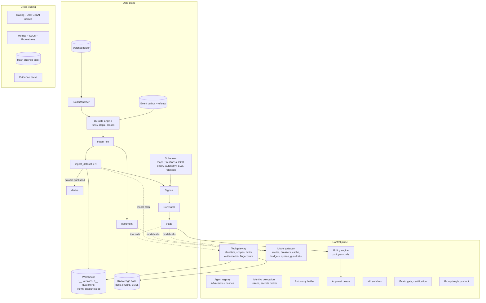

# SwarmPipe Architecture

## 1. Planes and components



| Plane | Components (code) |
|---|---|
| Control | `agents/registry.py`, `governance/identity.py`, `governance/policy.py`, `governance/autonomy.py`, `governance/approvals.py`, `governance/killswitch.py`, `llm/gateway.py`, `llm/prompts.py`, `tools/gateway.py`, `evals/` |
| Data | `runtime/engine.py`, `runtime/workflows.py`, `runtime/watcher.py`, `runtime/scheduler.py`, `core/events.py`, `data/*`, `memory.py` |
| Cross-cutting | `observability/*`, `governance/audit.py`, `governance/evidence.py` |
| Surfaces | `web/api.py` + `web/static/*` (dashboard), `cli.py`, `mcp_server.py`, A2A endpoints in `web/api.py` |

`app.py` is the composition root: every service is constructed once and passed explicitly (no globals), which
is also what lets the eval harness spin up fully isolated instances per trial.

## 2. The ingest path

```mermaid
sequenceDiagram
  participant FS as data/inbox
  participant W as Watcher
  participant E as Engine
  participant R as Router agent
  participant D as ingest_dataset (per sheet)
  participant G as Model gateway
  participant WH as Warehouse
  FS->>W: file appears (poll)
  W->>W: size+mtime stable for N polls? move to processing/ (atomic), sha256
  W->>E: submit ingest_file(file_id)
  E->>E: stage: integrity + duplicate check (content hash)
  E->>R: route (sniffer facts + first lines as UNTRUSTED)
  R->>G: router prompt (cheap tier)
  G-->>R: RouterOut (validated) -> deterministic guard
  E->>E: read frames; fan-out one child per sheet; WaitingFor(children)
  E->>D: privacy scan -> profile (+semantic typing) -> contract check (+critic)
  D->>D: transform (typed, row rejects, dedupe) -> data assurance checks
  alt all checks pass
    D->>WH: stage version t__..vN, snapshot, swap view (blue/green)
    D->>E: dataset.published -> derive rebuilds dependents
  else a check fails (circuit breaker)
    D->>WH: stage q__..vN (quarantined), view unchanged
    D->>E: signals -> Correlator
  end
  E->>FS: archive/ or quarantine/ ; lineage COMPLETE/FAIL
```

## 3. The triage path

```mermaid
sequenceDiagram
  participant C as Correlator
  participant S as Supervisor
  participant I as Investigators (parallel, read-only)
  participant T as Tool gateway
  participant P as Planner (+Critic)
  participant PE as Policy engine
  participant H as Human (dashboard/CLI/MCP)
  participant X as Executor
  participant V as Verifier
  participant L as Learner
  C->>C: cluster signals by tenant+dataset (+upstream root), debounce
  C->>S: triage(incident) [durable run, one trace]
  S->>I: signed task messages (route allowlist)
  I->>T: ReAct tool calls (budgets, loop detection)
  T-->>I: bounded results + evidence ids (+trust labels)
  I-->>S: signed findings -> blackboard
  S->>S: diagnose; groundedness gate; abstain if weak
  S->>P: diagnosis + impact + facts (+runbook hints, untrusted snippets spotlighted)
  P->>P: catalog + param validation; critic review; revise
  P->>PE: each proposal -> effect by autonomy level + escalations + denials
  PE-->>H: approvals (typed confirmation for high risk)
  H-->>X: decision event -> run resumes
  X->>T: act_* tool (only the Executor has write tools)
  X->>V: verify against ground truth; compensate on failure; autonomy evidence
  V->>L: postmortem, lesson (candidate), eval case (candidate); evidence pack
```

## 4. Trust boundaries

| Boundary | Untrusted side | Control at the boundary |
|---|---|---|
| Inbox -> pipeline | file names, headers, cell values, documents | stability + size limits, extension allowlist, parsing as strings, injection scan (`scan_frame`, `scan_text`), PII scan, contracts |
| Data -> prompts | anything that came from a file, a tool result marked untrusted, knowledge not yet promoted | spotlighting (`build_messages`), bounded blocks, PII redaction, secret-leak check (`ModelGateway._guard`) |
| Model -> system | every model output | schema validation + repair; catalog validation; policy engine; approvals; tool gateway authorization |
| Agent -> agent | messages between agents | HMAC signatures + route allowlist (`MessageBus`); typed payloads; single decision owner |
| System -> outside world | notifications | Executor-only; recipient handles resolved deterministically; egress allowlist |
| User -> system | dashboard/CLI/MCP requests | identity, roles, scopes, tenant access, typed confirmation, audit |
| Operator -> data | direct warehouse edits | checksums + out-of-band detector; immutable snapshots |

Deterministic components: watcher, engine, readers, transforms, checks, correlator, impact analyzer, policy
engine, executor, verifier, publisher, monitors. Probabilistic (model-backed) components: router, profiler
(semantic typing), steward, critic, transformer (date inference, verified), investigators, supervisor
(diagnosis), planner, learner, analyst, librarian, judge - each with a deterministic fallback.

## 5. Data model (state DB)

| Group | Tables |
|---|---|
| Execution | `runs`, `steps` (checkpoints), `step_attempts`, `idempotency`, `compensations`, `locks`, `events`, `event_offsets`, `dlq`, `runtime_flags` |
| Data plane metadata | `files`, `contract_versions`, `dataset_versions`, `dataset_state`, `check_results`, `quarantine_rows`, `pii_vault`, `lineage_events`, `lineage_edges`, `documents`, `chunks` |
| Triage | `signals`, `incidents`, `blackboard`, `evidence`, `proposals`, `approvals`, `notifications` |
| Governance | `audit`, `autonomy`, `autonomy_history`, `kill_switches`, `agent_registry`, `model_certifications`, `memory` |
| Telemetry | `spans`, `llm_calls`, `llm_cache`, `tool_calls`, `metric_points`, `quotas` |
| Evaluation | `eval_runs`, `eval_results`, `eval_candidates`, `shadow_comparisons`, `feedback` |

Warehouse DB: `t__<tenant>__<dataset>__v<N>` (immutable published versions), `q__...` (quarantined),
views `<tenant>__<dataset>`; `snapshots.db` holds a copy of every version (restore source).

## 6. Key design decisions (and when they would change)

| Decision | Why here | What would change it |
|---|---|---|
| One SQLite state store, WAL, thread-local connections | zero setup, inspectable with any SQLite browser, transactional semantics are real | multi-node: Postgres (state), Kafka/Service Bus (events), Temporal/Durable Functions (engine) |
| Own durable engine instead of Temporal | every mechanism is visible and ~500 lines | production: adopt a proven engine, keep the same semantics |
| Polling watcher | works on any drive/share | cloud: object-store events (S3/Blob) + a reconciliation sweep |
| JSON action protocol for tool use | works with any model (incl. 3B local models) and is fully inspectable | frontier models: native tool calling; keep the same gateway controls |
| Simulated models as default | deterministic evals, chaos knobs, no data leaves the machine | real deployment: certified models per role; keep the simulator for CI |
| Policy engine in Python + YAML | readable, testable | enterprise: OPA/Cedar with the same inputs and decision log |
| HMAC tokens + local master key | demonstrates short-lived scoped credentials and message signing | Entra ID / OIDC workload identities, KMS/Key Vault, mTLS |
| Pickle for internal step artifacts | pyarrow's native build is broken on this ARM64 Python | Parquet/Delta/Iceberg on object storage |
| BM25 retrieval | no embedding dependency, good enough for runbooks | hybrid lexical + vector search with permission trimming |
| Hash-chained audit in the same DB | tamper *evidence* | WORM storage / ledger database, periodic external anchoring |

## 7. Extending it

- **New dataset**: add `config/contracts/<name>.yaml` (bump `version` to re-import), optionally consumers in
  `config/consumers.yaml` and glossary terms in `config/glossary.yaml`.
- **New check**: add it to `data/quality.py` `run_checks` and map its `check_type` to a signal in
  `runtime/workflows.py` `CHECK_SIGNAL`.
- **New action**: params model + execute/compensate/verify in `tools/actions.py`, a policy entry in
  `config/policies.yaml`, planner behavior (prompt / simulator).
- **New agent**: subclass `Agent` (identity, scopes, tools, role), add a prompt in `prompts/`, register it in
  `agents/registry.py`, a route in `llm.profiles`, and eval cases.
- **New model provider**: any OpenAI-compatible endpoint is a config entry (`llm.providers`, `llm.models`, a
  profile); certify it per role before routing traffic to it.
